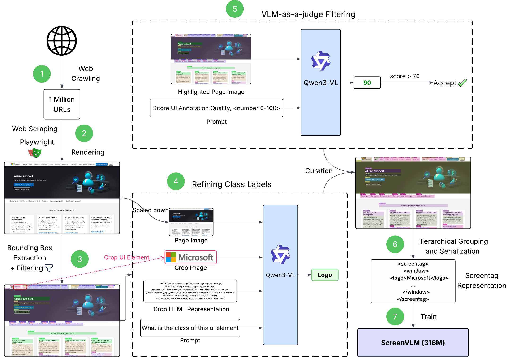

# [ICML 2026] ScreenParse

[](https://icml.cc/)
[](https://openreview.net/forum?id=H8KE7sudq5)
[](https://saidgurbuz.github.io/screenparse/)
[](LICENSE)

Official code release for **ScreenParse: Moving Beyond Sparse Grounding with Complete Screen Parsing Supervision**, accepted to **ICML 2026**.

ScreenParse studies complete screen parsing for computer-use agents: recovering visible UI elements, their locations, semantic types, text, and hierarchy from a screenshot. The project introduces:

- **ScreenParse**, a large-scale dataset with dense UI annotations over web screenshots.
- **Webshot**, the automated data generation and filtering pipeline used to build ScreenParse.
- **ScreenVLM**, a compact vision-language model trained for structured screen parsing.



## Repository Layout

```text
.
|-- webshot/      # Dataset generation, refinement, export, and evaluation toolkit
|-- docs/         # Project website published with GitHub Pages
|-- assets/       # Figures used by this repository README
`-- LICENSE
```

The runnable code currently lives in [`webshot/`](webshot/). Its README contains installation, dataset generation, VLM refinement, YOLO export, and evaluation instructions.

## Quick Start

```bash
cd webshot
uv sync
uv run playwright install chromium
uv run wsd --help
```

To run a small Webshot pipeline example:

```bash
cd webshot
uv run wsd pipeline --urls examples/urls_sample.csv --workers 4
```

See [`webshot/README.md`](webshot/README.md) and [`webshot/USAGE.md`](webshot/USAGE.md) for detailed usage.

## Links

- Project page: https://saidgurbuz.github.io/screenparse/
- Paper: https://openreview.net/forum?id=H8KE7sudq5
- Dataset: https://huggingface.co/datasets/docling-project/screenparse
- ScreenVLM: https://huggingface.co/docling-project/ScreenVLM
- ScreenParser: https://huggingface.co/docling-project/ScreenParser
- Webshot toolkit: [`webshot/`](webshot/)

## Citation

The official ICML proceedings citation will be added when available. For now, please cite:

```bibtex
@misc{gurbuz2026screenparse,
      title={ScreenParse: Moving Beyond Sparse Grounding with Complete Screen Parsing Supervision},
      author={A. Said Gurbuz and Sunghwan Hong and Ahmed Nassar and Marc Pollefeys and Peter Staar},
      year={2026},
      eprint={2602.14276},
      archivePrefix={arXiv},
      primaryClass={cs.CV},
      url={https://arxiv.org/abs/2602.14276},
      note={Accepted to ICML 2026}
}
```

## License

This repository is released under the MIT License. See [`LICENSE`](LICENSE) for details.
